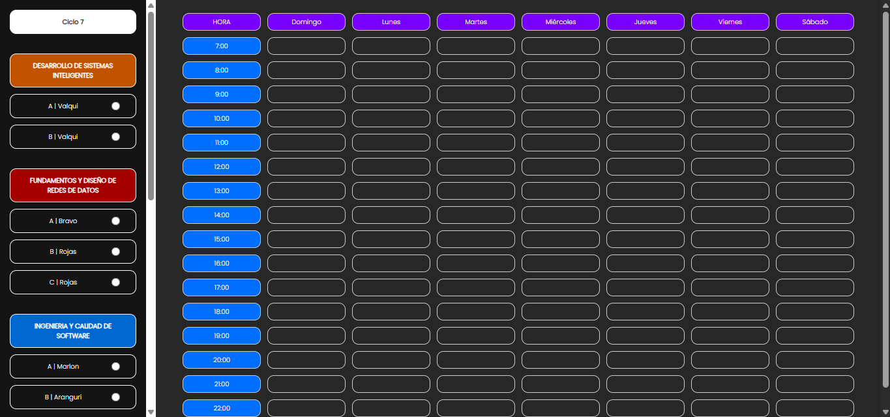
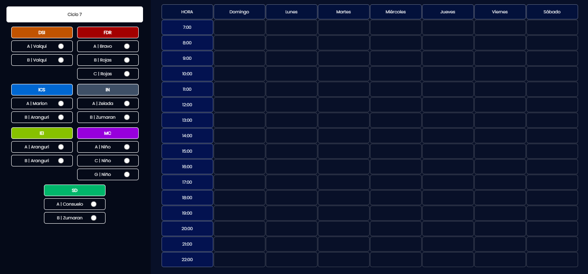

<!-- - B - DESARROLLO DE SISTEMAS INTELIGENTES
- A - FUNDAMENTOS Y DISEÑO DE REDES DE DATOS
- A - INGENIERÍA Y CALIDAD DE SOFTWARE
- B - INTELIGENCIA DE NEGOCIOS
- B - INVESTIGACIÓN EN INGENIERÍA
- G - MORAL CATOLICA
- B - SISTEMAS DISTRIBUIDOS
- C - FUTSAL
- _ - INGLES -->

v1

v2

